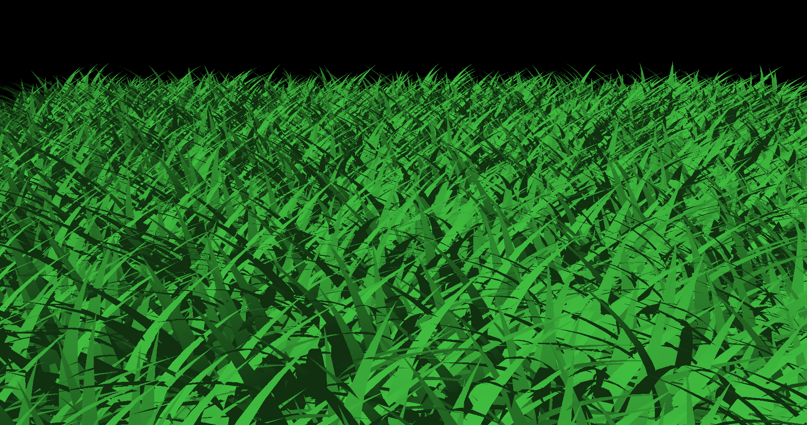

Vulkan Grass Rendering
==================================

**University of Pennsylvania, CIS 5650: GPU Programming and Architecture, Project 5**

* Michael Rabbitz
  * [LinkedIn](https://www.linkedin.com/in/mike-rabbitz)
* Tested on: Windows 10, i7-9750H @ 2.60GHz 32GB, RTX 2060 6GB (Personal)

## Part 1: Introduction

This project is an implementation of techniques described in [Responsive Real-Time Grass Rendering for General 3D Scenes](https://www.cg.tuwien.ac.at/research/publications/2017/JAHRMANN-2017-RRTG/JAHRMANN-2017-RRTG-draft.pdf), using Vulkan to build an efficient grass simulator and renderer. Grass blades are represented as Bezier curves, with a compute shader handling physics and culling processes, while graphics shaders manage rendering. The goal is to achieve realistic, performance-efficient grass rendering suitable for real-time applications.

The base code includes a basic Vulkan setup with a compute pipeline and two graphics pipelines. This implementation focuses on developing shaders for the grass compute and graphics pipelines, along with custom descriptor bindings necessary to manage data between these pipelines.

## Part 2: Simulating Forces
To create realistic movement, we simulate environmental forces on each grass blade using a compute shader.

Before we get into the simulated forces, here is an image showing the static, initial setup of the grass blades with no forces applied.

### Gravity
The first simulated force is gravity, which is an application of the Earth's downward gravitational force at 9.81 m/s2. As we can see, without a counter force, the blades are flattened to the ground plane.

|Gravity|
|:--:|
| <tr></tr>|

### Recovery
Next, we add the second simulated force, recovery, which counteracts gravity and returns the blades to equilibrium, following Hooke's law as derived in the paper.

|Gravity + Recovery|
|:--:|
| <tr></tr>|

### Wind
Finally, we add the third simulated force, wind, by implementing a custom wind function to influence the grass, considering the alignment of the blades with the wind direction.

The arbitrary wind function we use is: WIND_INTENSITY * vec3(cos(totalTime), 0.0, sin(totalTime)) * directional_alignment * height_ratio

|Gravity + Recovery + Wind|
|:--:|
| <tr></tr>|

## Part 3: Culling Tests
To optimize performance, various culling methods are implemented to avoid rendering blades that don’t contribute to the final image:

### Orientation Culling
In this technique, blades near-perpendicular or perpendicular to the camera are culled to prevent rendering artifacts.

### View-Frustum Culling
In this technique, blades outside the view-frustum are excluded based on visibility tests for each Bezier curve.

### Distance Culling
In this technique, blades beyond a certain distance are culled in buckets, with more distant blades culled more aggressively.

## Part 4: Performance Analysis
- Frames Per Second (FPS) is the measurment of performance in this section. FPS is measured using a GLFW timer within the main loop.
- The Test Scene is positioned to render many grass blades as we increase the count, and to apply all three culling options.

|Test Scene|
|:--:|
| <tr></tr>|

### Runtime vs Blade Count
- Culling ON refers to when all three culling options are enabled.

|  Blade Count  | Culling OFF (FPS) | Culling ON (FPS)  |
| ------------- | ----------------- | ----------------- |
|210 |1235               |1245               |
|212 |1145               |1230               |
|214 |565                |1130               |
|216 |195                |545                |
|218 |62                 |180                |
|220 |17                 |60                 |
|222 |4                  |16                 |
|224 |1                  |4                  |

**Observations**
- **Trend:** As the blade count increases, FPS decreases significantly in both cases, but with culling enabled, FPS remains higher.
- **Culling Efficiency:** At higher blade counts, culling's impact on performance becomes much more noticeable, maintaining playable FPS even as the blade count reaches 220.
- **Culling Overhead:** There’s minimal overhead for culling at lower blade counts, as FPS differences between Culling ON and OFF remain small.

### Runtime vs Culling Options
- Blade Count is 216 for the following tests.

|      Culling Option(s)     | FPS |
| -------------------------- | --- |
|Culling OFF                 |195  |
|Orientation                 |225  |
|View Frustrum               |200  |
|Distance                    |500  |
|Orientation + View Frustrum |215  |
|Orientation + Distance      |530  |
|View Frustrum + Distance    |505  |
|All Culling                 |545  |

**Observations**
- **Distance Culling Effectiveness:** Distance culling alone boosts FPS by over 2x, suggesting that rendering fewer distant blades is the most impactful optimization.
- **Combination Benefits:** Combining orientation and distance culling achieves the best performance increase, maximizing FPS at higher counts.
- **All Culling:** Using all three techniques offers slightly better performance than combining just two, but the difference is less significant than distance culling alone, indicating diminishing returns when all options are combined.
